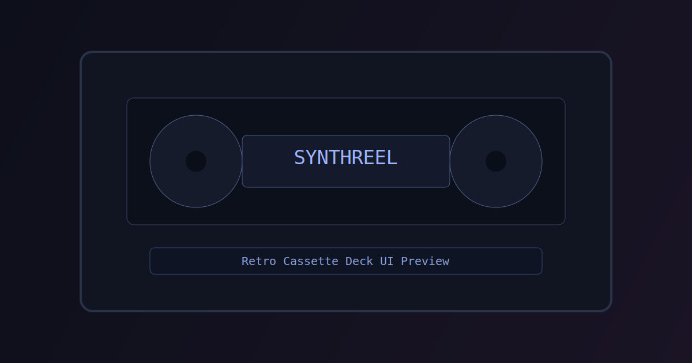

# SynthReel

[](https://github.com/dattaprasad-r-ekavade/BinaryRadio/actions/workflows/ci.yml)
[](LICENSE)
[](https://nodejs.org/)
[](./coverage/index.html)

Retro cassette-deck web app for generative music using [Strudel](https://strudel.cc).

Live demo: https://dattaprasad-r-ekavade.github.io/BinaryRadio/

## Preview




## Features

- Retro cassette deck interface with tape rack
- Track load/play/pause/stop/loop controls
- Radio mode with timed transitions
- Pre-generated RJ announcement playback (`public/rj/*.mp3`)
- Master volume + RJ volume + EQ strip
- Spectrum/waveform visualizer and VU meters
- Queue management and favorites
- In-browser tune editor
- WAV export
- Theme persistence and keyboard shortcuts
- Runtime tune loading from `public/tunes/manifest.json` with static seed fallback

## Quick Start

```bash
npm install
npm run dev
```

App runs at `http://localhost:5173`.

## Scripts

- `npm run dev` - run local dev server
- `npm run build` - production build
- `npm run preview` - preview built app
- `npm run test` - run unit/integration tests (Vitest)
- `npm run test:e2e` - run browser E2E tests (Playwright)
- `npm run lint` - lint source files
- `npm run format` - apply Prettier formatting to `src/`
- `npm run generate-rj` - generate RJ announcement MP3 files

### RJ Generation

Prerequisite: a reachable Kokoro TTS server exposing OpenAI-compatible speech API.

```bash
npm run generate-rj
node scripts/generate-rj.mjs --force
node scripts/generate-rj.mjs --dry-run
```

If `public/rj` files are missing, radio mode skips announcements and continues playback.

## Keyboard Shortcuts

| Key | Action |
| --- | --- |
| `Space` | Play / Pause |
| `S` | Stop |
| `N` | Next track |
| `P` | Previous track |
| `L` | Toggle loop |
| `+` / `=` | Increase tempo |
| `-` | Decrease tempo |
| `T` | Toggle light/dark theme |
| `H` | Toggle shortcuts help |

## Architecture

```text
src/
  App.jsx                 # thin orchestrator
  App.css                 # entrypoint imports variables + shell styles
  components/             # UI components with co-located CSS/tests
    Deck.jsx / Deck.css / Deck.test.jsx
    Rack.jsx / Rack.css / Rack.test.jsx
    CassetteCard.jsx / CassetteCard.css / CassetteCard.test.jsx
    QueuePanel.jsx / QueuePanel.css / QueuePanel.test.jsx
    Knob.jsx / Knob.css / Knob.test.jsx
    Reel.jsx / Reel.css
    Visualizer.jsx / Visualizer.css
    VUMeter.jsx / VUMeter.css
    TuneEditor.jsx / TuneEditor.css / TuneEditor.test.jsx
    HelpModal.jsx / HelpModal.css
    ErrorBoundary.jsx
  hooks/
    usePlayerState.js     # state composer
    useTransport.js       # transport + playback + radio orchestration
    useLibrary.js         # manifest, tracks, favorites
    useQueue.js           # queue state/actions
    useStrudel.js         # Strudel bootstrap + audio graph wiring + export
    useRadioMode.js       # radio scheduling + RJ transitions
    useKeyboardShortcuts.js
    useLocalStorage.js
  styles/
    variables.css         # design tokens and themes
    app.css               # shell/global styles
  data/
    tracks.js             # static seed tracks fallback
  utils/
    playlist.ts           # queue and favorites helpers
    tunePipeline.js       # normalize, validate, prep code
    wav.js                # WAV encoder
  rj/
    playAnnouncement.js   # RJ transition audio loader/player
  tests/                  # integration + accessibility tests
public/
  tunes/manifest.json     # runtime tune index
  tunes/*.md              # tune source files
  rj/*.mp3                # pre-generated RJ clips
scripts/
  generate-rj.mjs         # RJ clip generator
  kokoro_server.py        # optional local helper server
```

## Known Issues

- Strudel SharedWorker clockworker can fail in some CDN/browser combos.
- Workaround: `window.SharedWorker = undefined` is set in `index.html` before loading Strudel.
- Reference discussion: https://github.com/tidalcycles/strudel/pull/1129
- WebKit/Safari engine initialization may fail for Strudel in some environments (`ENGINE ERROR`).

## Governance and Community

- Contributing guide: [CONTRIBUTING.md](CONTRIBUTING.md)
- Code of conduct: [CODE_OF_CONDUCT.md](CODE_OF_CONDUCT.md)
- Security policy: [SECURITY.md](SECURITY.md)
- Changelog: [CHANGELOG.md](CHANGELOG.md)
- Manual QA log: [MANUAL_QA.md](MANUAL_QA.md)
- License: [LICENSE](LICENSE)

## Project Metadata

- Node: `>=18` (recommended via `.nvmrc` = `20`)
- License: `AGPL-3.0-or-later`
- Package visibility: this repo is intentionally `"private": true` in `package.json`.
  Distribution is source-first via GitHub rather than npm publishing.

## Repository

Source: https://github.com/dattaprasad-r-ekavade/BinaryRadio
